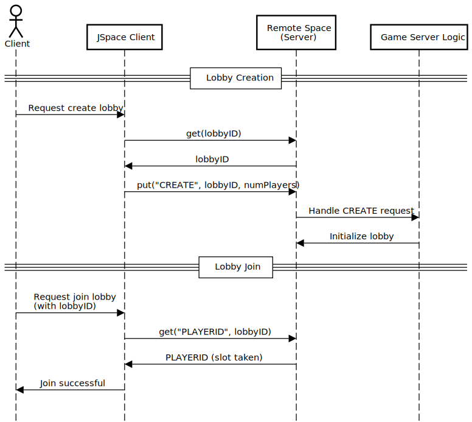

# Group 4 - Multiplayer Pacman

## Abstract
In this project, we plan to create a Player vs. Player version of Pacman. In our Pacman game, you can compete against your friends with up to four players at a time. In our version, players compete against each other and can eat one another to steal a portion of their points, further increasing their total score. There will be a central server to handle the clients, but most of the game logic will be distributed to the clients, using the server primarily for synchronization and to prevent cheating. The entire program will be developed in Java using JavaFX for the GUI. The backend will run and be hosted on a server, while players will run the client program locally. To avoid requiring players to install Java, we plan to compile the client program into a JAR file and create an executable that includes a JRE.

## Contributors
Project contributors:
* Maximillian (s236167@dtu.dk)
* Tobias (s235086@dtu.dk)
* Christian (s235091@dtu.dk)
* Gustav (s235063@dtu.dk)

We have all contributed to the bullet points below, however the names attributed are the persons with the largest contribution.

Contributions:
* Design of main coordination aspects: Maximillian
* Coding of main coordination aspects: Maximillian
* Documentation (this README file): Tobias, Gustav, Christian, Maximillian
* Demo video: Maximillian
* GUI: Tobias, Gustav
* Game Logic: Christian

The specifics of our code contributions can be viewed in our commit history.

## Demo video
* [Video 1](https://youtu.be/oYSZJfIy-Xs) - 4 player game over Discord
* [Video 2](https://youtu.be/ROx-BVXxOsA) - In person 2 player game

## Main coordination challenge
The main challenge of using jSpace to build a real-time multiplayer game is the overhead involved in sending data to and from the clients. A typical multiplayer game would transfer the entire game state between client and server to allow the server to calculate the next game state, but this approach would be too slow when using jSpace. Another option is to run the game logic on the clients and use the server only to share player movements. This approach is better suited for a coordinated distributed application, but it introduces another problem: if clients are responsible for calculating the game state, users could cheat by reporting higher scores than they actually have.

To solve this, we developed an idea partly inspired by blockchain architectures used for cryptocurrency. The idea is for the server to coordinate player actions and maintain a ledger of every move sent from the clients, along with a game clock indicating when each action was executed. The game is designed to be deterministic based on player actions, meaning that using the ledger, all clients and the server can calculate the same game state. This architecture allows for proof-checking game results if clients disagree. We did not implement proof-checking, as it was considered out of scope, and we assume clients only run our program. Another potential feature would be digital signatures, such as RSA, to confirm that any action sent to the server originates from the claimed client. Although these features were not implemented, the important aspect is that we designed an architecture that supports this level of security without sacrificing smooth gameplay, and we believe we succeeded in this goal.

## Programming language and coordination mechanism
### What is jSpace
jSpace is a library that supports programming concurrent and distributed applications using spaces. The library is used to build Java applications using the space paradigm, with tuples for message passing and coordination. One of the key concepts of jSpace is the implementation of Linda, which allows processes to interact indirectly by writing, reading, and taking tuples from shared spaces.

### How we use jSpace
The way we use jSpace is by passing actions from the players to our server. The server then cleans the actions and distributes the cleaned actions to the clients.
The way we clean actions is by indexing them with a clock tick. All actions are first sent to our “raw” stack. If an indexed action has a clock tick that is unsynchronized with the other ticks, the action is set to the correct clock tick to synchronize with the game. If the clock tick is in the wrong index, the action is cleaned and sent to the clean actions stack.

### How we use jSpace on the clients
On the client we use JSpace to tell the server to either create a game lobby or join an existing one. We create a lobby by fetching a lobby ID from the server, using a Remote Space, and sending a ‘CREATE’ request along with the number of players for the lobby back to the server. Then when someone else wants to connect to the created lobby, they can use the lobby ID and when they connect they indicate that they occupy a lobby position by removing a ‘PLAYERID’ from the Space.

### Sequence diagram


## Installation
Our Pacman game is compiled and all the required dependencies are included in the installer. The user is required to install the game and then run the .msi file. The installer is available on Windows 10+ [here](https://maximillian.info/files/Pacman-1.0.msi).

## Compiling

### Tested Operating Systems
* Windows 10+
* Arch Linux
* Debian Linux

### Requirements
* JDK 25
* Maven
* JavaFX
* JSpace

If you want to compile the game yourself you will need to have java 25 jdk or java 25 sdk. Then you will need javaFX 25.0.1+ and Maven 3.9.12.

Firstly you need to make a folder called JAVA on your computer to make it easier for yourself.
Download the desired java for your system.
https://www.oracle.com/java/technologies/downloads/

When downloaded the user needs to make a path to the downloaded java folder in environment variables. 

Use the windows search bar and look for environmental variables. Open environment variables on your computer. Now you will have the environmental variables tab open. Press the environment variables tab. Now you will see two different sections of the environmental variables.
Under system variables you will need to find the PATH. Select PATH and press edit. Now you need to make a new path to your java file. You need to path to your bin inside the java file. An example of the path could look like this: 
```bash
C:\Program Files\Java\jdk-25.0.2\bin
```
Now you have java installed. Check for the installation is a success you can open a terminal. Search for the terminal on your windows search bar. The terminal is open and now you can type: 
```bash
java -version
```
Now you will see something like this: 
```bash
java version "25.0.1" 2025-10-21 LTS
Java(TM) SE Runtime Environment (build 25.0.1+8-LTS-27)
Java HotSpot(TM) 64-Bit Server VM (build 25.0.1+8-LTS-27, mixed mode, sharing)
```

Java is now installed.

Now download JavaFX from their website:
https://gluonhq.com/products/javafx/ 

Now you need to download the desired JavaFX for your system. Scroll down to Supported Platforms section. Download the JavaFX where is says if you are using Windowns:
25.0.2
x64
SDK

### Maven Installation.
To install maven 3.9.12 on Windows it is the same way that you downloaded java. Open the website and use the provided link: https://maven.apache.org/download.cgi 

When the website is open you will see multiple things that you can download. If you are on Windows you press the first link beside the binary zip archive. Extract the archive in any directory of your choosing. When Maven is downloaded you need to make a PATH to the bin file in the Maven folder. 
On Debian maven can be installed with apt as such:
```bash
sudo apt install Maven
```
On Arch Maven can be installed with the following command:
```bash
sudo pacman -S maven
```

Confirm that you downloaded Maven correctly, you open a new terminal and type:
```bash
mvn -v
```
The result should look similar to:

```bash
Apache Maven 3.9.12 (848fbb4bf2d427b72bdb2471c22fced7ebd9a7a1)
Maven home: \apache-maven-3.9.12-bin\apache-maven-3.9.12
Java version: 25.0.1, vendor: Oracle Corporation, runtime: C:\Program Files\Java\jdk-25
Default locale: da_DK, platform encoding: UTF-8
OS name: "windows 11", version: "10.0", arch: "amd64", family: "windows"
```

The last step for you to compile the game is that you need to download the repository from gitlab: https://gitlab.gbar.dtu.dk/02148/02148-2026/Group004-YourProjectNameHere 

Open the link and press the Code button once you are on the website.
Extract the .zip file in your desired folder. 

### JSpace

Next you need JSpace. Navigate to the JSpace repository on github:

https://github.com/pSpaces/jSpace

Clone the repository with or simply download it as a .zip and extract the folder:
```bash
git clone https://github.com/pSpaces/jSpace
```
When downloaded you need to do the command:
```bash
mvn clean verify
```
Now add JSpace as a dependency in your java project. This process is already done for this game so no need to add it this time.

Navigate to the pac-man folder in the terminal. To compile the game you type:
```bash
mvn clean javafx:run
```
Now the program is compiled and you can play the game. 

# References
JSpace:
https://github.com/pSpaces/jSpace/tree/master 

Start menu graphics:
https://www.construct.net/en/tutorials/cloning-classics-pacman-171

Pixelated font:
https://www.fontspace.com/pixelated-elegance-font-f126145

Pacman sound effects:
https://downloads.khinsider.com/game-soundtracks/album/pac-man-game-sound-effect-original-soundtrack-2024 

Pacman objects sprite sheet:
https://www.vhv.rs/viewpic/hTxhbwm_transparent-pacman-sprite-png-pacman-sprite-sheet-png/

Maze Ghost AI Behaviors:
https://pacman.fandom.com/wiki/Maze_Ghost_AI_Behaviors 

# Class diagram


